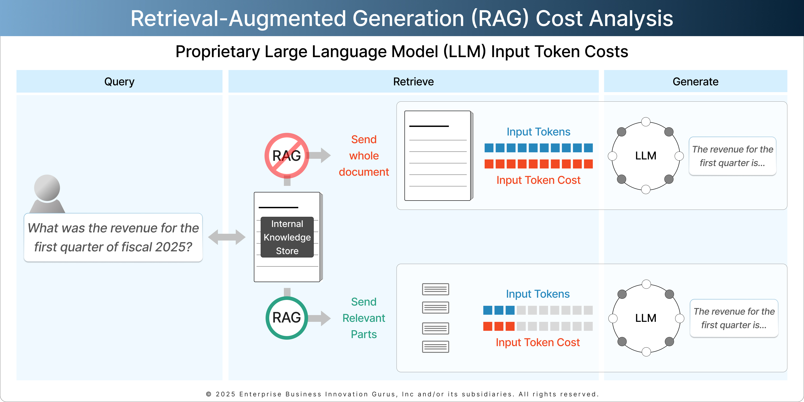
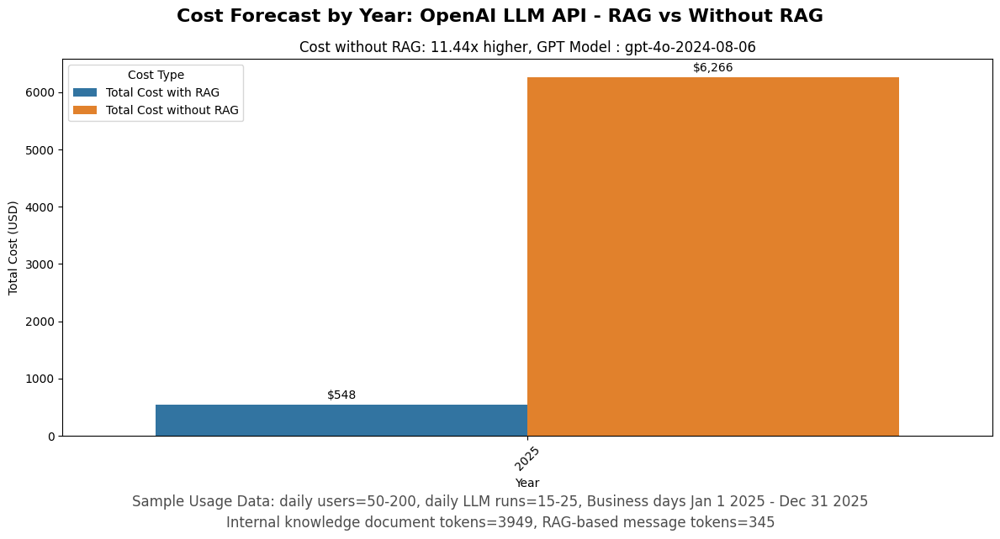

# Retrieval-Augmented Generation (RAG) Cost Analysis with OpenAI

| | |
|-|-|
|**AUTHORS**       |: Dan Carotenuto, Jason Harvey
|**COMPANY**       |: Enterprise Business Innovation Gurus, Inc
|**DATE PUBLISHED**|: March 21, 2025

---

# Disclaimer
* The provided notebook is for educational purposes to help the reader understand Retrieval-Augmented Generation and how it can affect proprietary LLM (e.g., OpenAI) application costs when querying a local  knowledge base. It is not meant for use as is in a production environment.
* The notebook was written for use with Google Colab to ensure it can run without the need for additional software or hardware requirements.
* The notebook was designed to be used without the need for an OpenAI license. "tiktoken" is a python library published by OpenAI and is used in this notebook to accurately calculate OpenAI's GPT model API input tokens.
* The notebook is governed under the MIT LICENSE which is included in the notebook.
* All proprietary LLM pricing, corresponding cost estimates, forecasts, and third party website links are as of the publish date (DATE PUBLISHED) of this notebook and are subject to change without notice.
* Converting the notebook for use in a production environments requires changes that may include but are not limited to refactoring the code, adding additional error handling, storing embeddings in a vector data store, alternative embedding chunk strategies and DevOps and LLMOps considerations.

# Executive Summary

**Retrieval-Augmented Generation (RAG)** provides a smarter way to leverage Large Language Models (LLMs) for use with local knowledge sources while reducing expenses, improving accuracy, enabling scalability and making generative AI apps economically viable.

This notebook shows how RAG can be used to help manage costs of proprietary LLMs, specifically OpenAI.

**What is RAG?**

RAG is an AI framework that enhances LLMs by retrieving relevant business information before generating responses. Instead of solely relying on a model's pre-trained knowledge, RAG pulls in real-time, business-specific information—typically in text documents—to provide accurate, contextual, and cost-effective answers.

Unlike traditional LLMs that require frequent fine-tuning, RAG dynamically retrieves information from local knowledge stores, allowing businesses to:
* Reduce AI token usage (lower API costs for proprietary LLMs)
* Improve accuracy (minimize AI hallucinations)
* Integrate real-time company data (no need for constant re-training)
* Ensure compliance & data security (keep proprietary data internal)

**RAG is a Two-step Process**
1. **Retrieval**: A vector source (e.g., Pinecone, Weaviate, ChromaDB) stores document embeddings (pre-processed text chunks). When a query is received, the system retrieves the most relevant chunks using similarity search.

2. **Generation**: The retrieved data is appended to an LLM prompt, providing additional context for generating a response. This avoids the need for fine-tuning, making the system dynamic and cost-efficient.

As shown in the figure below, "Retrieval-Augmented Generation (RAG) Costs Analysis," using a RAG framework can result in significant cost savings for generative AI apps.

# Using the Notebook
The notebook is a Google Colab notebook written in Python. The notebook was designed to be opened and run in Google Colab.

The notebook shows how to accurately calculate usage input token costs for a propreitary LLM, specifically, OpenAI. It uses a fictitious company's financial report as an internal knolwedge document and 1 year of synthetic usage data to forecast OpenAI usage costs for input tokens based on a user query. The figure below shows cost forecast for a year for user input tokens with RAG and without RAG.

[Back to top](#retrieval-augmented-generation-rag-cost-analysis-with-openai)
